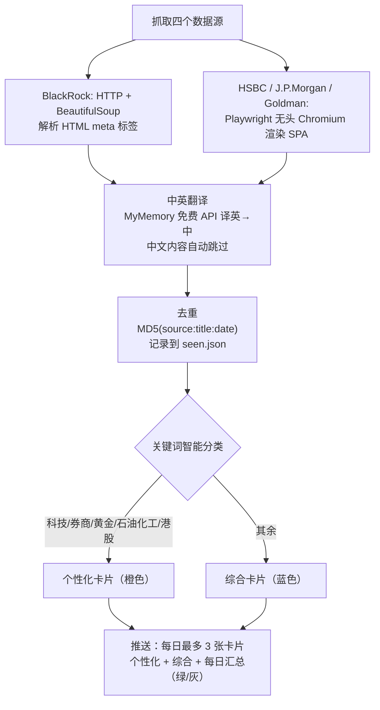

<div align="center">

# 投资评论自动推送 (feishu-pusher)

**每天自动抓取四大机构的投资评论，智能分类后通过飞书群机器人推送到群聊。**

Auto-fetch investment commentary from BlackRock / HSBC / J.P. Morgan / Goldman Sachs, classify, and push to a Feishu (Lark) group via webhook bot.


</div>

> 💡 **看不懂怎么用？** 把这个仓库（或这个网址）扔给你的 AI 助手，说一句「按这个帮我把飞书投资评论推送配好」，让它读完替你装依赖、填 Webhook、跑 `fetcher.py` 和定时任务就行。

---

## 目录

- [它做什么](#它做什么)
- [数据源](#数据源)
- [工作原理](#工作原理)
- [快速开始](#快速开始)
- [文件说明](#文件说明)
- [常见问题 FAQ](#常见问题-faq)
- [许可证](#许可证)

---

## 它做什么

自动抓取 **BlackRock、HSBC、J.P. Morgan、Goldman Sachs** 的投资评论，智能分类为「个性化」和「综合」两张批量卡片，通过飞书群机器人推送到群聊。可配合 Windows 计划任务每天上午 10:00 自动检查并推送新文章。

## 数据源

- **贝莱德每周投资评论**：[BlackRock Global Weekly Commentary](https://www.blackrock.com/cn/global-weekly-commentary)
- **汇丰最新市场动态**：[HSBC Latest Market Views](https://www.hsbc.com.cn/content/hsbc/cn/zh_cn/wealth/insights.html/#Latest-views)
- **摩根大通财富洞察**：[J.P. Morgan Wealth Management Insights](https://www.jpmorgan.com/wealth-management/wealth-partners/insights)
- **高盛洞察**：[Goldman Sachs Insights](https://www.goldmansachs.com/insights)

## 工作原理



- **BlackRock**：HTTP 请求 + BeautifulSoup 解析 HTML meta 标签
- **HSBC / J.P. Morgan / Goldman Sachs**：Playwright 无头 Chromium 渲染 SPA 页面后提取内容
- **中英翻译**：通过 MyMemory 免费 API 将英文标题/摘要译为中文，中文内容自动跳过
- **智能分类**：关键词匹配将文章分为「个性化」（科技/券商/黄金/石油化工/港股）和「综合」两类
- **去重**：基于 `MD5(source:title:date)` 的 `seen.json` 记录已推送文章
- **推送**：每日最多 3 张飞书卡片 — 个性化内容卡（橙色）+ 综合内容卡（蓝色）+ 每日汇总（绿色/灰色）

## 快速开始

### 1. 安装依赖

```bash
pip install requests beautifulsoup4 lxml playwright
playwright install chromium
```

### 2. 配置

```bash
cp config.example.json config.json
```

编辑 `config.json`，填入你的飞书群机器人 Webhook URL。

### 3. 运行

```bash
python fetcher.py
```

### 4. 设置定时任务（Windows）

以管理员身份运行：

```powershell
powershell -ExecutionPolicy Bypass -File setup_task.ps1
```

每天上午 10:00 自动检查并推送新文章。

## 文件说明

| 文件 | 说明 |
|------|------|
| `fetcher.py` | 主脚本 |
| `config.json` | 配置文件（已 gitignore） |
| `config.example.json` | 配置文件模板 |
| `seen.json` | 推送记录（已 gitignore） |
| `setup_task.ps1` | Windows 定时任务创建脚本 |

## 常见问题 FAQ

**Q：为什么部分源要用 Playwright 而不是直接请求？**
A：HSBC / J.P. Morgan / Goldman Sachs 的页面是 SPA，需要无头 Chromium 渲染后才能取到内容；BlackRock 可直接 HTTP + BeautifulSoup 解析 meta。

**Q：英文内容怎么处理？**
A：通过 MyMemory 免费 API 把英文标题/摘要译成中文；本身是中文的内容自动跳过翻译。

**Q：会不会重复推送同一篇？**
A：不会。基于 `MD5(source:title:date)` 记录在 `seen.json`，已推送的会跳过。

**Q：定时任务不生效？**
A：`setup_task.ps1` 需以**管理员身份**运行；计划任务设为每天上午 10:00 触发。

## 许可证

[MIT](LICENSE) © 2026 zhiyutong
